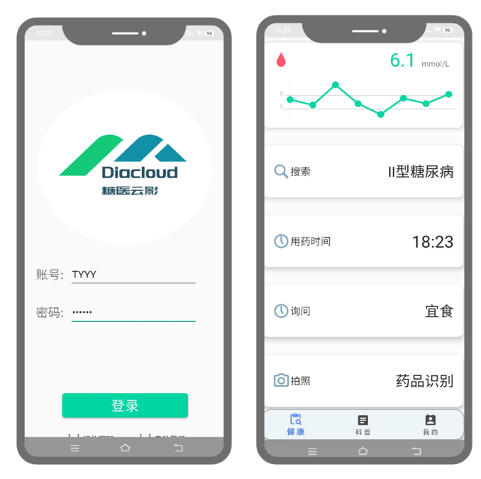
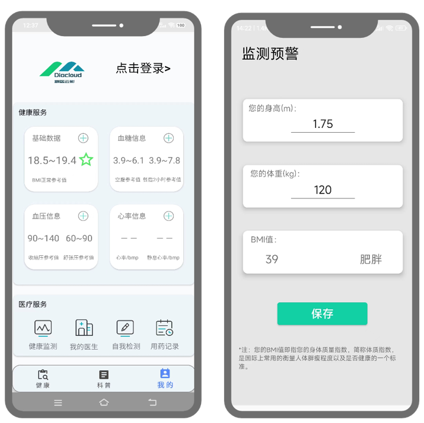
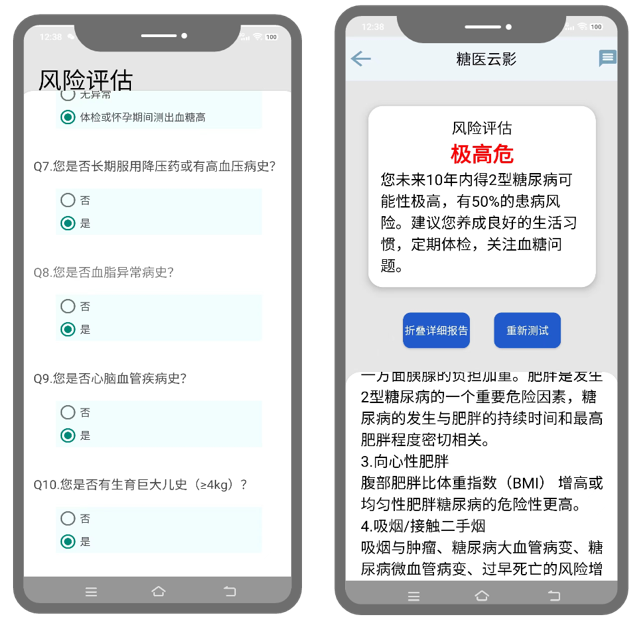

# DiaCloud Android APP

This is a Java implementation of DiaCloud, and the code includes the following modules:

- Android components for mobile application

Source code is comming soon, you can first take a look at the rendering of our software below.

## Rendering

### Log on

### Health management

### Diabetes Q&A dialogue interface

### Diabetes information science popularization

### Disease risk assessment and warning

